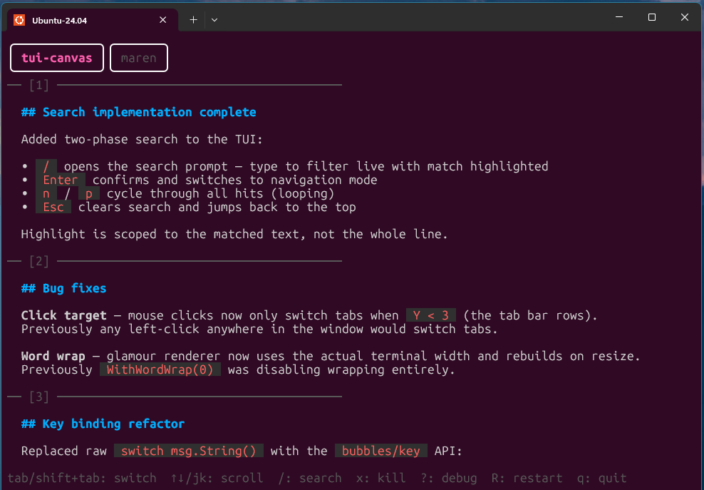
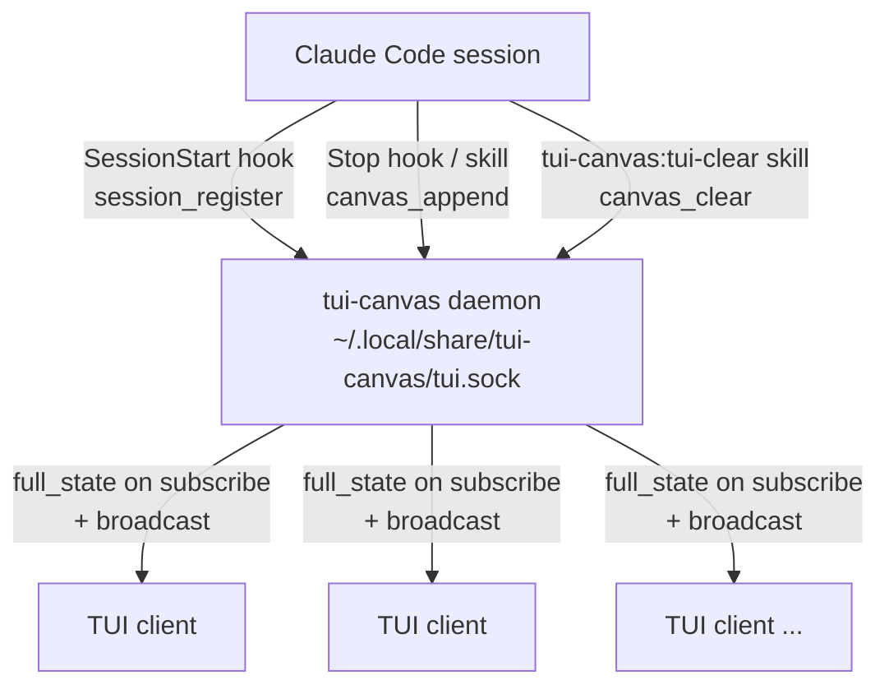

# tui-canvas

A persistent canvas display panel that lives alongside your Claude Code sessions. Open it in a split pane and Claude pushes notes, summaries, code snippets, and other content to it via the `/tui-canvas` skill — rendered as markdown, organised into per-session tabs, and kept in sync across any number of open TUI windows.



## How it works

tui-canvas is three things in one binary:

- **Daemon** — a background process that owns all state (sessions + canvas entries) and broadcasts changes over a Unix socket. Starts automatically when you open the TUI; persists until you kill it.
- **TUI client** — a bubbletea terminal UI that subscribes to the daemon and renders content. Multiple instances (e.g. in tmux split panes) all show the same live state.
- **Claude Code plugin** — hooks and skills that let Claude register sessions and push content without you needing to do anything manually.



Each Claude Code session automatically registers itself on start. Claude can then push content at any point using the `/tui-canvas:tui-canvas` skill, which the Stop hook also invokes automatically.

## Installation

### 1. Install the Claude Code plugin

Run these two slash commands inside Claude Code:

```
/plugin marketplace add jredville/tui-canvas
/plugin install tui-canvas@tui-canvas
```

The binary downloads automatically on your first session start (requires `curl` and internet access). Supported platforms: Linux (amd64, arm64), macOS (amd64, arm64).

### 2. Open the TUI

```bash
tui-canvas
```

This auto-starts the daemon if it isn't already running. Open as many instances as you want in split panes — they all stay in sync.

## Usage

### Skills

- **`/tui-canvas:tui-canvas`** — pushes the previous assistant response (or any text supplied after the command) to the current session's canvas
- **`/tui-canvas:tui-clear`** — clears the canvas for the current session

Each Claude session gets its own tab, registered automatically when the session starts.

### Daemon management

```bash
tui-canvas restart   # graceful restart; TUIs reconnect automatically
tui-canvas list      # print all registered sessions (id  name  cwd)
```

### Manual canvas control

```bash
# Append markdown content to a session
tui-canvas append SESSION_ID <<'EOF'
## Summary
This is **markdown** content.
EOF

# Clear a session canvas
tui-canvas clear SESSION_ID
```

Get `SESSION_ID` from `tui-canvas list`, or press `?` in the TUI to show session IDs in the tab bar.

## Keyboard shortcuts

| Key | Action |
|-----|--------|
| `tab` / `shift+tab` | Switch sessions |
| `↑` / `↓` / `j` / `k` | Scroll |
| `/` | Open search |
| `n` / `p` | Next / previous match |
| `Enter` | Confirm search / exit navigation |
| `Esc` | Cancel search and jump to top |
| `x` | Kill current tab (press `x` again to confirm) |
| `R` | Restart daemon |
| `?` | Toggle debug info (shows session IDs) |
| `q` / `ctrl+c` | Quit |

### Search

Press `/` to open the search prompt. As you type, the first match is highlighted and the viewport scrolls to it. Press `Enter` to confirm and switch to navigation mode, where `n`/`p` cycle through all matches (looping at the boundaries). Press `Enter` again to exit and stay at the current position, or `Esc` to clear the search and return to the top.

## Socket protocol

Newline-delimited JSON over a Unix socket at `~/.local/share/tui-canvas/tui.sock`.

**Plugin → Daemon:**

| Type | Fields |
|------|--------|
| `session_register` | `session_id`, `name`, `cwd` |
| `canvas_append` | `session_id`, `content` (markdown) |
| `canvas_clear` | `session_id` |
| `session_remove` | `session_id` |
| `daemon_restart` | _(none)_ |
| `list_sessions` | `cwd` (optional filter) |

**TUI → Daemon:** `{"type":"subscribe"}`

**Daemon → TUI (broadcast):**

| Type | Fields |
|------|--------|
| `full_state` | `sessions` array (sent immediately on subscribe) |
| `session_added` | `session_id`, `name`, `cwd` |
| `canvas_appended` | `session_id`, `entry` (`content`, `index`) |
| `canvas_cleared` | `session_id` |
| `session_removed` | `session_id` |
| `daemon_restarting` | _(none, sent before graceful exit)_ |

## Releasing a new version

```bash
make release VERSION=vX.Y.Z
git add plugin/VERSION && git commit -m "release vX.Y.Z" && git push
```

`make release` cross-compiles for all platforms, creates the GitHub release with binaries attached, and writes `plugin/VERSION`. On the next session start, Claude Code users automatically download the new binary.
